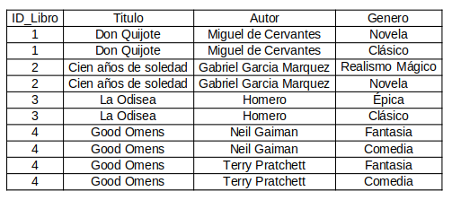

## Ejercicio Práctico 1

**Caso: Base de datos de una biblioteca**

El antiguo DBA de la biblioteca diseñó la base de datos de la siguiente manera:


### Problemas identificados:

1. Las columnas Autor2 y Autor3 tienen valores NULL cuando el libro tiene un solo autor.
2. Las columnas Genero2 tienen valores NULL cuando el libro pertenece a un solo género.
3. No se puede añadir más de tres autores ni más de dos géneros sin modificar la estructura de la tabla.

### Tareas a realizar: 

- Normaliza la tabla Libros a la Primera Forma Normal (1NF)

### Instrucciones:

1. Reorganiza los datos de manera que cada columna contenga valores atómicos.
2. No debe haber conjuntos de valores repetidos. Como por ejemplo, si un libro tiene más de un autor, cada autor debe estar en una fila distinta.

---

### Respuesta:

Luego de reorganizar la tabla quedo de esta manera en la Primera forma normal (1NF)




---

## Ejercicio Práctico 2

**Caso: Base de datos de una tienda en línea**

El antiguo DBA de la tienda diseñó la base de datos de la siguiente manera:


#### Problemas identificados:

1. La información del cliente se repite para cada producto en el mismo pedido.
2. La información del producto se repite para cada pedido en el que aparece.

#### Tareas a realizar: 

- Normaliza la tabla Pedidos a la Segunda Forma Normal (2NF).

#### Instrucciones:

1. Crea tablas separadas para Clientes, Productos y Detalles de Pedidos.
2. Asegúrate de eliminar las dependencias parciales. Recordemos que una dependencia parcial es cuando una columna depende solo de una parte de la clave primaria, o sea, de un solo atributo y no de todos los atributos que conforman la clave primaria.

---

### Respuesta:

Resolviendo en segunda forma normal (2NF)


---

## Ejercicio Práctico 3

**Caso: Base de datos de un hospital**

El antiguo DBA del hospital diseñó la base de datos de la siguiente manera:

```plaintext
Consultas:
| ID_Consulta | ID_Paciente | Paciente         | Doctor       | Especialidad |
|-------------|-------------|------------------|--------------|--------------|
| 1           | 100         | Juan Pérez       | Dr. Smith    | Cardiología  |
| 2           | 101         | Ana Gómez        | Dr. Johnson  | Neurología   |
| 3           | 100         | Juan Pérez       | Dr. Smith    | Cardiología  |
| 4           | 102         | Maria López      | Dr. Lee      | Pediatría    |
```

#### Problemas identificados:

1. La información del paciente se repite en varias consultas.
2. La especialidad del doctor se repite en cada consulta.

#### Tareas a realizar:

- Normaliza la tabla Consultas a la Tercera Forma Normal (3NF).

#### Instrucciones:

1. Crea tablas separadas para Pacientes, Doctores y Consultas.
2. Asegúrate de eliminar las dependencias transitivas. Una dependencia transitiva ocurre cuando una columna depende indirectamente de la clave primaria, es decir, depende de otro atributo que no es la clave primaria. Por ejemplo, en la tabla Inscripciones, el departamento dependía del profesor, y el profesor dependía del curso, por lo que el departamento dependía indirectamente del curso. Al separar las tablas, se eliminó esta dependencia transitiva (departamento -> profesor -> curso).

---
### Respuesta:

Resolviendo en tercera forma normal (3NF)


---

## Ejercicio Práctico 4

**Caso: Base de datos de proyectos de investigación**

El antiguo DBA de la universidad diseñó la base de datos de la siguiente manera:

```plaintext
Proyectos:
| ID_Proyecto | Nombre_Proyecto    | ID_Profesor | Nombre_Profesor |
|-------------|--------------------|-------------|------------------|
| 1           | IA Avanzada        | 101         | Dr. Smith        |
| 2           | Robótica           | 102         | Dr. Johnson      |
| 3           | IA Aplicada        | 101         | Dr. Smith        |
| 4           | Redes de Computo   | 103         | Dr. Lee          |
```

#### Problemas identificados:

1. El nombre del profesor se repite en varias filas.
2. Existe una dependencia funcional parcial entre ID_Profesor y Nombre_Profesor.

#### Tareas a realizar:

Normaliza la tabla Proyectos a la Forma Normal de Boyce-Codd (BCNF).

#### Instrucciones:

1. Crea tablas separadas para Proyectos y Profesores.
2. Asegúrate de que cada determinante sea una clave candidata. Una clave candidata es un conjunto de atributos que identifica de manera única a cada fila de una tabla. Por ejemplo, en la tabla Empleados, el ID del empleado es una clave candidata porque identifica de manera única a cada empleado.

---
### Respuesta:

Resolviendo en la Forma Normal de Boyce-Codd (BCNF)


---

## Ejercicio Práctico 5

**Caso: Base de datos de empleados y habilidades**

El antiguo DBA de la empresa diseñó la base de datos de la siguiente manera:

```plaintext
Empleado_Habilidades:
| ID_Empleado | Nombre_Empleado | Habilidad           |
|-------------|-----------------|---------------------|
| 1           | Juan Pérez      | Programación        |
| 1           | Juan Pérez      | Diseño de Bases de Datos |
| 2           | Ana Gómez       | Programación        |
| 2           | Ana Gómez       | Análisis de Datos   |
```

#### Problemas identificados:

1. La información de habilidades multi-valuadas.
2. La información de empleados se repite en varias filas

#### Tareas a realizar:

Normaliza la tabla Empleado_Habilidades a la Cuarta Forma Normal (4NF).

#### Instrucciones:

1. Crea tablas separadas para Empleados y Habilidades.
2. Asegúrate de eliminar las dependencias multi-valuadas. Recordemos por dependencia multi-valuada a cuando un atributo depende de un conjunto de otros atributos, en lugar de depender de un solo atributo. Esto, lo podemos lograr separando los atributos en tablas distintas.

---
### Respuesta:

Resolviendo en la Cuarta Forma Normal (4NF)


---

## Ejercicio Práctico 6

Caso: Base de datos de contratos

El antiguo DBA de la empresa diseñó la base de datos de la siguiente manera:

```plaintext
Contratos:
| ID_Proyecto | ID_Empleado | ID_Proveedor |
|-------------|-------------|--------------|
| 1           | 1           | 1001         |
| 1           | 2           | 1002         |
| 2           | 1           | 1001         |
```

#### Problemas identificados:

1. Existencia de juntas de dependencia entre proyectos, empleados y proveedores. Recordemos que una junta de dependencia ocurre cuando un atributo depende de otro atributo que no es la clave primaria. Aqui, esto esta ocurriendo entre los atributos ID_Empleado e ID_Proveedor, puesto que ambos dependen del ID_Proyecto.

#### Tareas a realizar:

Normaliza la tabla Contratos a la Quinta Forma Normal (5NF).

#### Instrucciones:

1. Crea tablas separadas para Proyectos, Empleados y Proveedores.
2. Asegúrate de eliminar las juntas de dependencia. Una junta de dependencia ocurre cuando un atributo depende de otro atributo que no es la clave primaria. Por ejemplo, en la tabla Contratos, el ID_Empleado y el ID_Proveedor dependen del ID_Proyecto, en lugar de depender de la clave primaria de su propia tabla.


---
### Respuesta:

Resolviendo en la Quinta Forma Normal (5NF)


---


## Ejercicio Práctico 7

**Caso: Base de datos de ventas en una tienda**

El antiguo DBA de la tienda diseñó la base de datos de la siguiente manera:

```plaintext
Ventas:
| ID_Venta | Cliente        | Producto     | Precio | Fecha       |
|----------|----------------|--------------|--------|-------------|
| 1        | Juan Pérez     | Camiseta     | 20.00  | 2023-01-01  |
| 2        | Ana Gómez      | Pantalones   | 25.00  | 2023-01-02  |
| 3        | Juan Pérez     | Camiseta     | 20.00  | 2023-01-03  |
```

#### Problemas identificados:

1. La información del cliente se repite en varias ventas.
2. La información del producto y su precio se repiten en varias ventas.

#### Tareas a realizar:

Normaliza la tabla Ventas para eliminar la redundancia de datos.

#### Instrucciones:

1. Crea tablas separadas para Clientes, Productos y Ventas.
2. Asegúrate de eliminar los datos duplicados.

---
### Respuesta:

Resolviendo el ejercicio de Base de datos de ventas en una tienda


---


## Ejercicio Práctico 8

**Caso: Base de datos de inventarios en un almacén**

El antiguo DBA del almacén diseñó la base de datos de la siguiente manera:

```plaintext
Inventarios:
| ID_Inventario | Producto         | Cantidad_Ubicaciones           |
|---------------|------------------|--------------------------------|
| 1             | Tornillos        | A1:100, B2:200                 |
| 2             | Clavos           | A3:150, B4:100                 |
```

#### Problemas identificados:

1. La información de las ubicaciones y cantidades no es atómica.
2. La información de los productos se repite en varias filas.

#### Tareas a realizar:

Normaliza la tabla Inventarios para lograr atomicidad en los datos.

#### Instrucciones:

1. Crea tablas separadas para Inventarios y Detalle_Ubicaciones.
2. Asegúrate de que cada registro en las tablas contenga valores atómicos.

---
### Respuesta:

Resolviendo el ejercicio de la tabla Inventarios para lograr atomicidad en los datos


---
